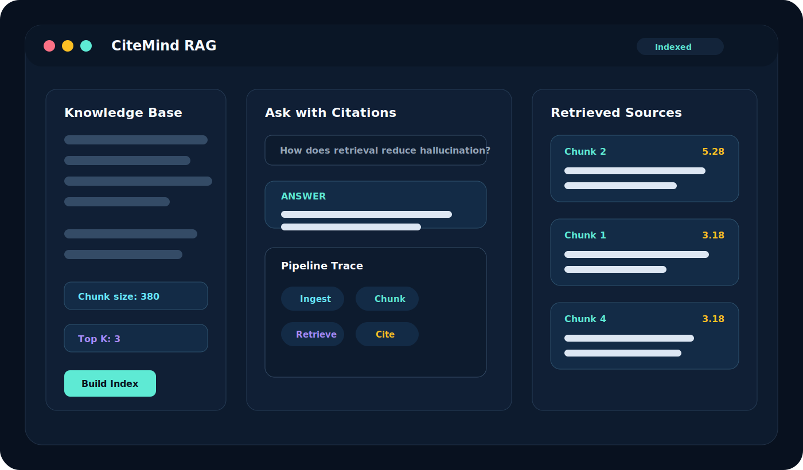

# CiteMind RAG

<p align="center">
  
</p>

<h1 align="center">CiteMind RAG</h1>

<p align="center">
  <strong>Local-first Retrieval-Augmented Generation Studio · 本地优先的 RAG 检索增强生成工作台</strong>
</p>

<p align="center">
  CiteMind RAG is an original browser-based RAG demo with document chunking, local retrieval scoring, citation cards, and answer synthesis.
  <br />
  CiteMind RAG 是一个原创浏览器端 RAG 项目，支持文档切块、本地检索评分、引用片段和答案合成。
</p>

<p align="center">
  <a href="https://github.com/jsdnaasd/citemind-rag/stargazers"></a>
  
  
  
</p>

---

## Why

Many RAG demos hide the retrieval step. CiteMind makes the retrieval loop visible: users can paste source text, build chunks, ask a question, inspect ranked citations, and see how an answer should be grounded.

很多 RAG 项目只展示最终回答，但真正重要的是“回答来自哪里”。CiteMind 把检索过程展示出来：文档如何切块、哪些片段被命中、分数是多少、答案引用了哪些来源。

## What It Does

- **Document ingestion**: paste raw notes, docs, specs, or research text.
- **Chunking**: split long text into adjustable context windows.
- **Local retrieval**: rank chunks with a TF-IDF style lexical scorer.
- **Citations**: show source cards with scores and snippets.
- **Answer synthesis**: produce a grounded answer from retrieved chunks.

- **文档导入**：粘贴笔记、文档、产品说明或研究资料。
- **文本切块**：把长文档拆成可检索的上下文片段。
- **本地检索**：使用轻量 TF-IDF 风格评分进行排序。
- **引用展示**：展示命中的来源片段、分数和内容。
- **答案合成**：基于检索片段生成可追溯回答。

## Architecture

```text
Document Text
  -> Chunking
  -> Tokenization
  -> Local Retrieval Scoring
  -> Ranked Citations
  -> Grounded Answer Draft
```

Production extensions:

- embedding model integration
- vector database adapter
- hybrid keyword + semantic retrieval
- reranker layer
- PDF / Markdown loaders
- LLM answer generation with strict citations
- evaluation and observability dashboard

生产化扩展方向：

- 接入 embedding 模型
- 接入向量数据库
- 混合关键词与语义检索
- 增加 reranker 重排层
- 支持 PDF / Markdown 文档解析
- 接入大模型生成带引用回答
- 增加评测与可观测性面板

## Run Locally

This project is static and does not require a backend.

```bash
python3 -m http.server 5173
```

Open:

```text
http://localhost:5173
```

## Roadmap

- PDF and Markdown import
- Browser-side embedding demo
- Citation highlighting inside source text
- Evaluation set for retrieval quality
- Exportable RAG report
- Optional OpenAI / local model connector

## Disclaimer

This is an engineering demo for learning and prototyping RAG. It does not claim production retrieval accuracy or LLM answer quality.

本项目用于 RAG 工程学习和产品原型展示，不声明具备生产级检索准确性或大模型回答质量。
