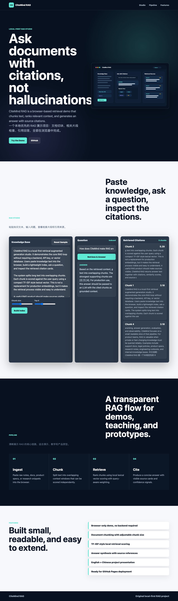
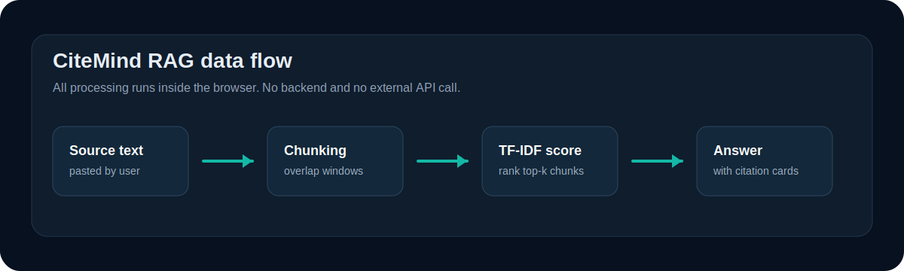

# CiteMind RAG

Browser-based RAG playground for showing the retrieval step, not just the final answer.

中文说明：这是一个浏览器端 RAG 小项目，重点展示“文档如何被切块、问题如何命中片段、回答引用了哪些来源”。

[Live demo](https://jsdnaasd.github.io/citemind-rag/) · [Repository](https://github.com/jsdnaasd/citemind-rag)

<p align="center">
  
</p>

## What Is Implemented

- Paste source text into a local knowledge area.
- Split text into overlapping chunks in the browser.
- Build a simple document-frequency map for the chunks.
- Score chunks against a query with a TF-IDF style lexical scorer.
- Show the top-k chunks as citation cards with scores.
- Draft a short answer from the highest-ranked context and show chunk references.

中文：

- 粘贴知识文本。
- 在浏览器里把文本切成带重叠的 chunk。
- 为 chunk 构建词频和文档频率索引。
- 用轻量 TF-IDF 风格算法对问题和 chunk 做匹配。
- 展示 top-k 引用片段、分数和内容。
- 根据命中的片段生成一个带引用编号的回答草稿。

## Retrieval Logic

The retrieval code lives in [`script.js`](script.js). It intentionally stays small so the ranking behavior is easy to inspect.

```text
source text
  -> normalize whitespace
  -> split into overlapping chunks
  -> tokenize each chunk
  -> count document frequency per token
  -> tokenize query
  -> score each chunk with tf * idf
  -> return top-k chunks
  -> draft answer with chunk references
```

Current scoring formula:

```text
score(chunk, query) = sum(tf(token, chunk) * idf(token))
idf(token) = log((chunk_count + 1) / (doc_frequency(token) + 1)) + 1
```

This is not semantic search. It is a readable baseline that makes the retrieval loop visible.

中文：当前版本不是语义向量检索，而是一个可读性优先的关键词检索基线，用来展示 RAG 的基本流程。

## Architecture

<p align="center">
  
</p>

The app has no backend and no external API calls. All state stays in the browser tab.

中文：项目没有后端，也不调用外部 API。所有处理都在当前浏览器标签页里完成。

## Run Locally

```bash
git clone https://github.com/jsdnaasd/citemind-rag.git
cd citemind-rag
python3 -m http.server 5173
```

Open:

```text
http://localhost:5173
```

## Verification

Manual check:

```bash
python3 -m http.server 5173
```

Then open the page and test:

- click `Reset Sample`
- change `Chunk size`
- change `Top K`
- ask `How does CiteMind make RAG answers easier to verify?`
- confirm the answer changes with the retrieved citation cards

Lightweight static check:

```bash
python3 -m http.server 5173
curl -I http://localhost:5173
```

中文：这个项目目前没有自动化测试。验证方式是本地启动静态服务，检查页面、检索结果和 citation cards 是否正常更新。

## Known Limitations

- No embeddings or vector database.
- No PDF, Markdown, or URL loader.
- No LLM API call; answer drafting is a deterministic browser function.
- No persisted knowledge base.
- The tokenizer is simple and works best for English text.
- Retrieval quality depends heavily on exact term overlap.

中文限制：

- 没有接入 embedding 模型或向量数据库。
- 不支持 PDF、Markdown、网页链接导入。
- 没有调用大模型，回答只是前端函数生成的草稿。
- 知识库不会持久保存。
- 分词器很轻量，对英文更友好。
- 检索质量依赖关键词重合，不等同于生产级 RAG。

## Roadmap

- Add Markdown and PDF import.
- Add browser-side embedding experiment.
- Add source text highlighting for cited chunks.
- Add retrieval evaluation examples.
- Add optional OpenAI or local model answer generation.
- Add exportable RAG report.

中文下一步：

- 增加 Markdown / PDF 导入。
- 尝试浏览器端 embedding。
- 在原文中高亮被引用片段。
- 加入检索效果评测样例。
- 可选接入 OpenAI 或本地模型生成回答。
- 支持导出 RAG 报告。
